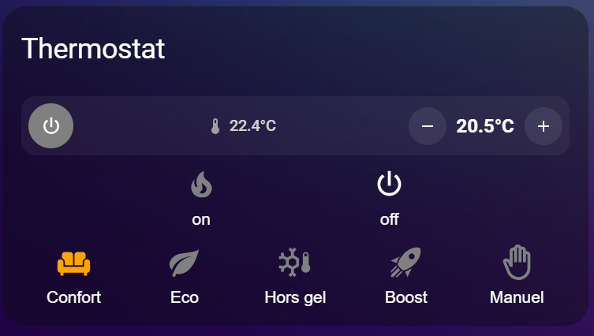
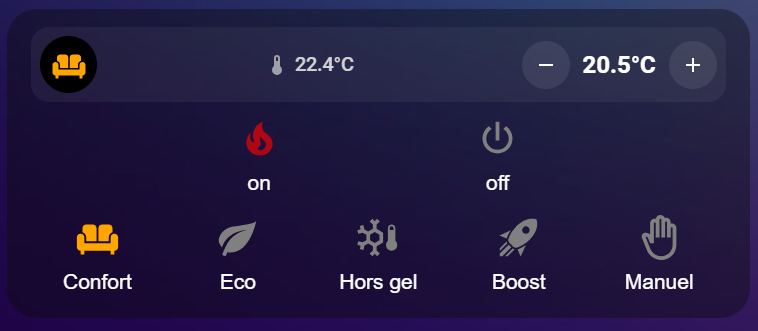

# 🌡️ Thermostat Card

Une carte minimaliste et performante écrite en JavaScript pur (`LitElement`) pour contrôler efficacement vos entités `climate` sans dépendances externes.

## ✨ Fonctionnalités
* **Zéro dépendance :** Pas besoin d'installer *Mushroom*, *Stack-in-card*, *Button-card* ou *Card-mod*. Tout est inclus nativement.
* **Dynamique :** L'icône centrale change de forme, de couleur et s'anime (clignotement en mode chauffe) selon l'état actuel du thermostat.
* **Contrôle rapide :** Ajustement de la température (+/- 0.5°C), gestion du mode On/Off et sélection immédiate des presets (Confort, Éco, Hors gel, Boost, Manuel).

---

## 🛠️ Configuration Rapide

Ajoutez simplement ce bloc dans votre tableau de bord en mode YAML :

```yaml
type: custom:thermostat-chambre-card
title: Thermostat Chambre 1
entity: climate.thermostat_salon_cuisine
```


| Option | Type | Requis | Par défaut | Description |
| :--- | :--- | :---: | :---: | :--- |
| `type` | string | **Oui** | - | Doit être obligatoirement `custom:thermostat-chambre-card`. |
| `entity` | string | **Oui** | - | L'identifiant de votre entité de chauffage (ex: `climate.thermostat_salon`). |
| `title` | string | Non | - | Le titre personnalisé affiché en haut de la carte (ex: `Chambre 1`). |


<div style="text-align: center;">
  <p style="font-style: italic; color: gray; margin-top: 8px;">Aperçu de la carte Thermostat version chauffage</p>
  
  
  <p style="font-style: italic; color: gray; margin-top: 8px;">Aperçu de la carte Thermostat version climatisation</p>
  
</div>

